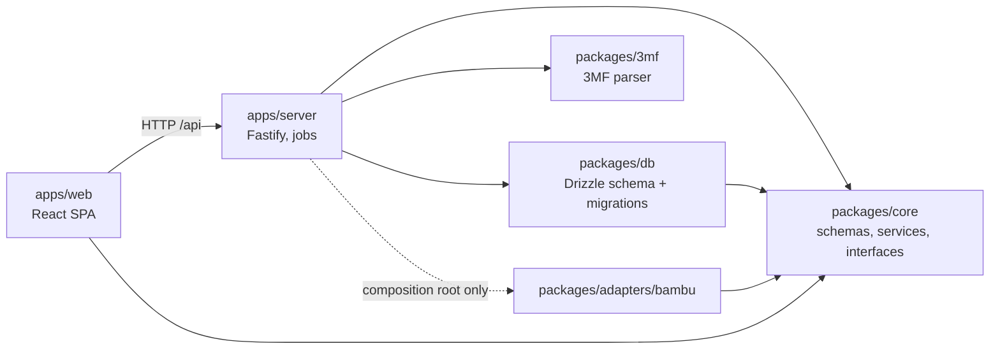
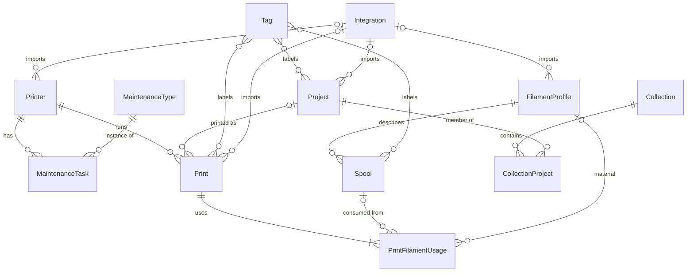
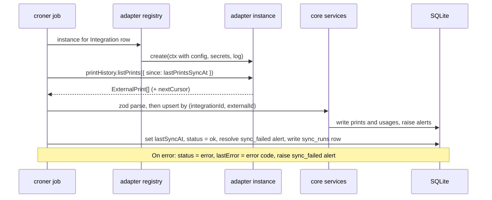

# Architecture

3D Maker Suite is a local-first web app: a Fastify server on the user's PC serves a React SPA and owns a single SQLite database. Vendor integrations (Bambu Lab first) plug in through small capability interfaces defined in core.

Decisions behind this document live in [`docs/adr`](adr/):

| ADR | Decision |
|---|---|
| [0001](adr/0001-local-only-run.md) | Run locally, bind to 127.0.0.1, no auth |
| [0002](adr/0002-sqlite.md) | SQLite via better-sqlite3 + Drizzle |
| [0003](adr/0003-adapter-pattern.md) | Brand-agnostic core, vendor adapters |
| [0004](adr/0004-i18n-strategy.md) | i18next, Intl formatting, error codes from the API |
| [0005](adr/0005-secrets-storage.md) | AES-256-GCM with a local key file |
| [0006](adr/0006-bambu-cloud-first.md) | Bambu Cloud is the first integration |

## Packages



- `packages/core` imports no vendor code. Neither does `apps/web`, and in `apps/server` only the composition root that builds the adapter registry may import one.
- `apps/web` imports only zod schemas and types from core. It never imports services.
- Zod schemas in `packages/core/src/schemas` are the single source of types. API validation, OpenAPI and the frontend all use them.

## Conventions

- **IDs:** `crypto.randomUUID()` as text.
- **Time:** UTC ISO 8601 strings, shown in the user's locale and time zone.
- **Units:** mass in grams, length in mm, duration in seconds.
- **Money:** integer minor units in one app currency, set in Settings.
- **Display:** all formatting goes through `Intl` (see ADR-0004).
- **Imported rows:** any row that can come from an integration has `origin: 'manual' | 'integration'`, `integrationId?` and `externalId?`, with a unique constraint on `(integrationId, externalId)`. That makes sync an idempotent upsert.
- **Catalog:** brands, printer models and machine profiles are hard-deleted, and only while nothing points at them (`ON DELETE RESTRICT`, the API answers 409). Imported printers keep sending brand/model strings; sync finds or creates the catalog rows.
- **Soft archive:** printers, spools, filament profiles, maintenance types and projects get `archivedAt` instead of being deleted, so their history stays intact. Foreign keys from history rows use `ON DELETE RESTRICT`, so a hard delete fails instead of orphaning stats. Prints are hard-deleted (their filament usages cascade).
- **Dates in queries:** stored as `toISOString()` text, so range filters compare as strings and use the date indexes (`prints.startedAt`).

## Domain glossary

| Entity | Meaning | Key fields |
|---|---|---|
| **Brand** | Printer maker | name (unique, any case), url?, logoPath? |
| **PrinterModel** | A model of a brand | brandId, model (unique per brand, any case), powerW? (pre-fills new printers), imagePath? (shown for printers without a photo) |
| **MachineProfile** | Slicer machine preset for a model | name, printerModelId, nozzleDiameterMm, sourcePreset? (`<library>:<preset id>` when imported) |
| **Printer** | A physical machine | name, modelId, serial?, nozzleDiameterMm, runtimeOffsetSec, printsOffset (baseline for a used machine), state (from the `printerStates` setting), powerW?, purchasedAt?, purchasePrice?, warrantyEndsAt?, warrantyNotes?, photoPath?, archivedAt? |
| **PrinterComment** | Note on a printer timeline | printerId, body, pinned, status (`open` | `resolved`) |
| **MaintenanceType** | Reusable maintenance template | name, intervalSec?, intervalPrints?, intervalDays? (the first one reached triggers), appliesToModelIds[] + appliesToPrinterIds[] (union; empty = all printers) |
| **MaintenanceTask** | A logged "done" event | printerId, typeId, doneAt, printerRuntimeSecAt, printerPrintsAt, notes? |
| **FilamentProfile** | A material spec (settings only, no colour) | brand, material (PLA, PETG…), name, diameterMm, densityGcm3, pricePerKg? |
| **Spool** | A physical roll of filament | profileId, colorHex, initialGrams, remainingGrams, pricePaid, purchasedAt?, openedAt?, location?, archivedAt? |
| **Print** | One print job | printerId, projectId?, machineProfileId?, title, plate?, startedAt, durationSec, outcome, failureReason?, notes?, energyWh?, energySource? (`'estimated' \| 'measured'`), costSnapshot? |
| **PrintFilamentUsage** | Filament used by one print, one row per slot (AMS) | printId, spoolId?, profileId?, grams, slot? |
| **PrintOutcome** | Value type on Print, no table of its own | `'success' \| 'failed' \| 'cancelled'`, plus an optional failureReason |
| **Project** | A printable model, usually a 3MF file | name, filePath?, sourceUrl?, thumbnailPath?, meta (plates, estimated time and grams per plate) |
| **Tag** | Free-form label | name, color. Many-to-many with Project, Print and Spool |
| **Collection** | Manual, ordered group of Projects | name, description?. Membership: CollectionProject(collectionId, projectId, position) |
| **Integration** | A configured adapter instance | adapterId (e.g. `bambu-cloud`), name, enabled, config (JSON, not secret), secrets (encrypted), status, lastSyncAt?, lastError? |
| **Alert** | A persisted notice raised by a job | kind, entityType, entityId, createdAt, readAt?, resolvedAt? |

Notes:

- **Maintenance "due" is computed, not stored.** It comes from the latest MaintenanceTask for each (printer, type), compared with the printer's current hours, print count and the date.
- **Printer totals are derived.** Hours and print count are the sum of its Prints plus `runtimeOffsetSec`/`printsOffset`.
- **Usage keeps the profile.** `PrintFilamentUsage.spoolId` can be null for imported prints where the spool is unknown. `profileId` keeps the material, so cost and stats still work.
- **Cost is snapshotted.** `costSnapshot` freezes the computed cost when a print is recorded, so later price changes don't rewrite history (cost engine: Step 19).
- **Alert kinds:** `maintenance_due`, `spool_low`, `sync_failed`, `print_failed`. At most one unresolved alert exists per (kind, entityType, entityId).
- **Tag storage** is one polymorphic table, `taggings(tagId, entityType, entityId)`. It has no FK to the tagged row, so a trigger removes the taggings of deleted prints (spools and projects are only archived).
- **Print rules** are enforced as DB CHECKs and mirrored in zod: a `success` print has no `failureReason`, and `energyWh` and `energySource` are set together.

## Entity relations



`Alert` points to any entity through `(entityType, entityId)`. It is left out of the diagram because it has no foreign key.

## Integration interfaces

These live in `packages/core/src/integrations`. Only `printers` and `printHistory` exist in code so far; the other capabilities are added by the steps that use them (14, 16, 18). Rules:

- Adapters **return DTOs and never touch the database.** Core validates the DTOs with zod and upserts them by `(integrationId, externalId)`.
- Each capability is an optional property on the instance. An adapter implements only what its vendor supports.
- An adapter is one source: `kind: 'cloud'` is an account, `kind: 'local'` a folder and program on the server's disk. A vendor with both ships two adapters (Bambu Cloud and Bambu Studio). The kind says where data comes from, not which types: `capabilities` lists those. A cloud source is usable once signed in, a local one once its folder is found on the server; otherwise the hub shows it as not available.
- The DTO types below are the `z.infer` shapes of zod schemas in `packages/core/src/schemas`.

```ts
interface IntegrationAdapter {
  id: string;                    // 'bambu-cloud'; UI name is the i18n key `integrations:adapters.<id>.name`
  kind: 'cloud' | 'local';
  capabilities: Capability[];    // only what this source really provides
  configSchema: ZodObject;       // non-secret settings
  secretsSchema: ZodObject;      // fields encrypted at rest (ADR-0005)
  create?(ctx: IntegrationContext): IntegrationInstance;  // account-backed; a local source has none
  library?: FilamentLibrary;     // a slicer's presets, read from its config folder
}

interface IntegrationContext {
  config: unknown;               // already parsed with configSchema
  secrets: SecretStore;
  log: Logger;                   // pino child logger, secret paths redacted
  signal: AbortSignal;
}

interface SecretStore {          // scoped to one Integration row
  get(key: string): Promise<string | undefined>;
  set(key: string, value: string): Promise<void>;   // e.g. refreshed tokens
  delete(key: string): Promise<void>;
}

interface IntegrationInstance {
  test(): Promise<{ ok: true } | { ok: false; code: IntegrationErrorCode }>;
  printers?: PrinterInventorySource;
  printHistory?: PrintHistorySource;
  filaments?: FilamentLibrarySource;
  projects?: ProjectSource;
  slicer?: SlicerLauncher;
  marketplace?: MarketplaceLinker;
}

type IntegrationErrorCode =
  | 'auth_required' | 'auth_expired' | 'rate_limited' | 'unreachable' | 'unknown';

interface PrinterInventorySource {
  listPrinters(): Promise<ExternalPrinter[]>;
}

interface PrintHistorySource {
  listPrints(q: { since?: string; until?: string; cursor?: string }):
    Promise<{ items: ExternalPrint[]; nextCursor?: string }>;
}

interface FilamentLibrarySource {
  listProfiles(): Promise<ExternalFilamentProfile[]>;
}

interface ProjectSource {
  scan(): AsyncIterable<ExternalProject>;
  watch?(onChange: (e: { type: 'upsert' | 'remove'; externalId: string }) => void): () => void;
}

interface SlicerLauncher {
  canOpen(filePath: string): boolean;
  open(filePath: string): Promise<void>;
}

interface MarketplaceLinker {     // pure, no network in v1
  matchUrl(url: string): ListingRef | null;
  findInProject(meta: ProjectMeta): ListingRef | null;  // e.g. designer URL in 3MF metadata
}

type ExternalPrinter = {
  externalId: string; name: string; brand: string; model: string;
  serial?: string; nozzleDiameterMm?: number;
};

type ExternalPrint = {
  externalId: string; printerExternalId: string; title: string; startedAt: string;
  durationSec?: number; outcome: PrintOutcome; failureReason?: string;
  filaments: { slot?: number; material?: string; colorHex?: string; grams: number }[];
  coverUrl?: string; sourceUrl?: string;  // shown, never fetched by core
};

type ExternalFilamentProfile = {
  externalId: string; brand: string; material: string; name: string;
  diameterMm: number; densityGcm3?: number;
};

type ExternalProject = { externalId: string; name: string; filePath: string; modifiedAt: string };

type ListingRef = { marketplace: string; listingId: string; url: string };
```

The local-folder `ProjectSource` (3MF folder watcher, Step 16) isn't tied to any vendor. It ships as a built-in source in the server, not as an adapter package.

### Sync flow



- **Where:** `apps/server/src/integrations/sync.ts`. A croner job ticks every 15 minutes and runs each enabled integration whose own frequency (`15m`, `1h`, `1d`, `1w`, `1M` or `off`) has passed since its last successful scheduled run. A manual run can be limited to one type (`printers` or `prints`); a prints run can take a `from`/`to` range, which re-reads that window without moving the incremental start (`lastPrintsSyncAt`). Each run is logged with its type and range. Spools are not a sync type: importing one needs a filament profile picked per spool, so they keep the preview and confirm flow. One run per integration at a time (409 `sync_running`).
- **Dedupe is insert-only** on `(integrationId, externalId)`: a row that already exists is skipped, never overwritten, so local edits win. Each run re-fetches prints from `lastSyncAt - 7 days`, so prints that finished after the previous run are not missed.
- **Imported prints** need their printer to be imported by the same integration first; otherwise they are skipped. Filament usages are stored with grams and slot only (spool/profile matching: Step 13).
- **Sync log:** `sync_runs` keeps the last 100 runs per integration (trigger, result, error code, created/skipped counts).
- **Deleting an integration** keeps the imported rows (`integrationId` becomes null) and drops its credentials and sync log.

### Adding a vendor

1. Create `packages/adapters/<vendor>` named `@3d-maker-suite/adapter-<vendor>` that exports an `IntegrationAdapter`. Throw `IntegrationError(code)` for known failures. `packages/adapters/mock` is the reference.
2. Add it to `apps/server/package.json` and to the list in `apps/server/src/integrations/registry.ts`, the only file allowed to import adapters (Biome `noRestrictedImports`).
3. Add `integrations:adapters.<id>.name` and `.fields.<field>` to `apps/web/src/locales/en/integrations.json`. The setup form is generated from `configSchema` and `secretsSchema`.

## Runtime layout

See ADR-0001. The data directory holds:

```
app.sqlite        database (WAL mode)
secret.key        32-byte encryption key, user-only permissions
thumbnails/       extracted 3MF / print thumbnails
backups/          VACUUM INTO snapshots
```
